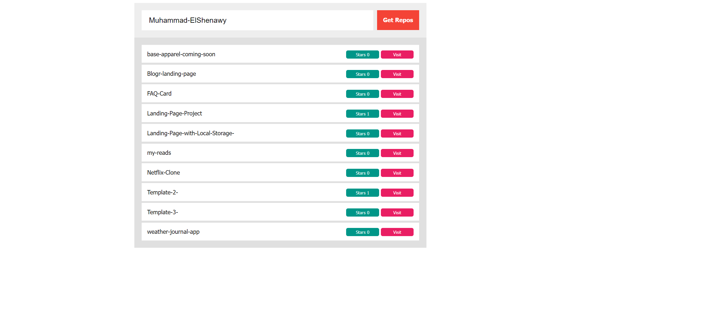

# Get-Repositories

\*Get Repositories by **_user name._**

---

### OverView

> You can get GitHub repositories by typing the user name, so you can visit the repositories also you can see how many start on each Repository.

---

## Hosting

The App hosted on GitHub Pages

---

## Technologies

> To fetching GitHub Repositories by user name i Used fetch function in javascript to get GitHub API's.

---

### Project files

1. index.html
2. style.css
3. app.js
4. IMGS

---
